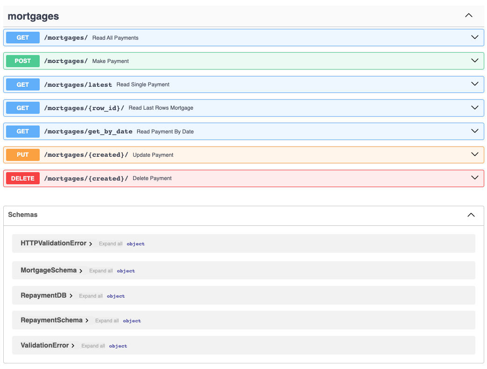

# Mortgage App

The app calculates the amount of the monthly payment for a mortgage loan. The user can specify the amount of the loan, the interest rate, the number of years, and the date of the first payment. The app will then calculate the amount of the monthly payment.


## Installation

Install the environment

```bash
  pip install poetry
```
    
## Run Locally

Clone the project

```bash
  git clonehttps://github.com/statsit/mortgage-app.git
```

Go to the project directory

```bash
  cd mortgage-app
```

Docker Compose Build

```bash
  make docker_build
```


## Usage/Examples

### Get list all payments made to the mortgage

```javascript

```javascript
  async function getMortgage() {
    try {
      const response = await axios.get('http://localhost:8000/mortgages/');
      console.log(response);
    } catch (error) {
      console.error(error);
    }
  }
```

```bash 
  curl -X GET \
  "http://localhost:8000/mortgages/" 
  -H  "accept: application/json"
```


## API Reference




## Roadmap

- Additional browser support

- Add more integrations


# Hi, I'm Ade! 👋


## 🚀 About Me
I'm a full stack AI developer...


## Authors

- [@aakinlalu](https://www.github.com/aakinlalu)


## License
[](https://choosealicense.com/licenses/mit/)
[](https://opensource.org/licenses/)
[](http://www.gnu.org/licenses/agpl-3.0)


## Contributing

Contributions are always welcome!

See `contributing.md` for ways to get started.

Please adhere to this project's `code of conduct`.

